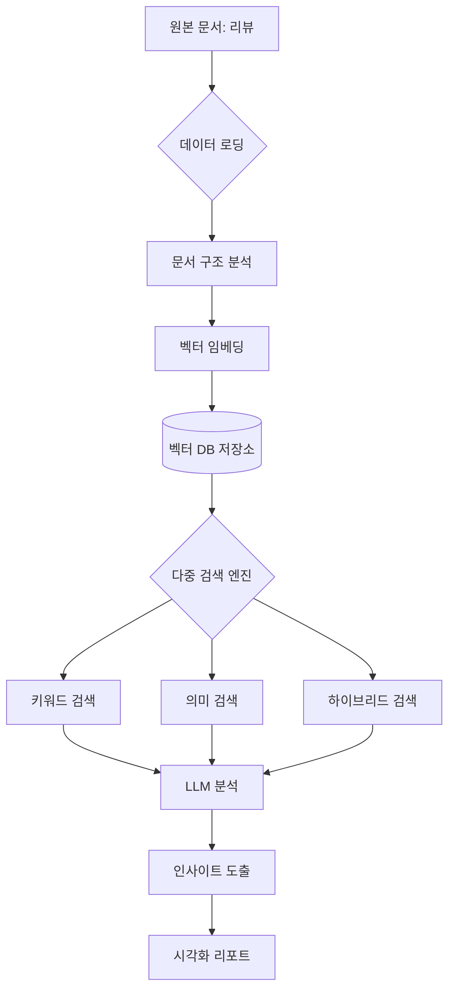

**교육 콘텐츠 개요서**  
**제목**: LLM 기반 문서 검색 & 데이터 인사이트 추출 클래스
**대상**: LLM 분석 기술을 업무에 적용해야 하는 데이터 분석가
**소요 시간**: 8시간 (이론 40% + 실습 60%)  

---

### **1. 모듈별 커리큘럼 설계**

#### **모듈 1: LLM 검색 엔진 핵심 아키텍처** (2시간)
- **학습 목표**: 하이브리드 검색 시스템의 작동 원리 이해
- **주요 내용**:
  ```python
  # search_engine.py 주요 기능 시연
  hybrid_engine = HybridSearchEngine(index_path="faiss_index")
  results = hybrid_engine.search("고객 불만 사례", top_k=5)
  ```
  - 벡터 검색(FAISS) + 키워드 검색(BM25) 결합 전략
  - OpenAI 임베딩 최적화 기법
  - 검색 결과 재랭킹 알고리즘

#### **모듈 2: 데이터 파이프라인 구축** (1.5시간)
- **실습 포인트**:
  ```python
  # data_loader.py 활용 예시
  loader = DataLoader(formatting_rules=JSON_TEMPLATE)
  raw_data = loader.load_from_dir("review_data/")
  ```
  - 다중 포맷(JSON/CSV/TXT) 데이터 수집 전략
  - 데이터 정규화를 위한 커스텀 파서 개발
  - Airflow를 이용한 데이터 수집 및 전처리, 분석 파이프라인 구축

#### **모듈 3: LLM 기반 인사이트 생성** (2.5시간)
- **코드 분석 포인트**:
  ```python
  # analysis.py 심층 분석
  analyzer = InsightAnalyzer(distribution=REAL_DISTRIBUTION)
  insights = analyzer.generate_insights(docs, max_tokens=4000)
  ```
  - 프롬프트 엔지니어링 템플릿 설계
  ```python
  PROMPT_TEMPLATE = """다음 내용에서 {category} 관련 인사이트 추출:
  {context}"""
  ```
  - 분포 기반 샘플링 알고리즘
  - 신뢰도 점수 계산 로직

#### **모듈 4: 분석 결과 평가 & 시각화** (2시간)
- **핵심 실습**:
  ```python
  # evaluation.py 메트릭 계산
  evaluator = InsightEvaluator(metrics=["relevance", "novelty"])
  scores = evaluator.evaluate(insights)
  ```
  - 정량적 평가 지표 설계 방법
  - matplotlib/seaborn 커스텀 시각화 기법
  ```python
  # visualization.py 확장 기능
  vis.plot_comparison(real_dist, generated_dist)
  ```

---

### **2. 실습 환경 구성**
1. **필수 패키지**:
   ```bash
   pip install python-dotenv faiss-cpu langchain-openai openai matplotlib seaborn pandas scikit-learn rank_bm25 tiktoken faker tqdm
   ```
2. **샘플 데이터 구조**:
   ```
   /review_data
     └── customer_feedback_*.txt
   ```
   - generate_review_data.py를 이용한 임의의 데이터 생성

---

### **3. 학습 성과 측정 지표**
1. **실습 과제**:  
   - 사용자 리뷰 데이터셋에 대한 E2E 분석 파이프라인 구현
   ```python
   def run_pipeline(query: str):
       docs = loader.load()
       results = engine.search(query)
       insights = analyzer.generate(results)
       evaluator.save_report(insights)
       vis.export_dashboard()
   ```
2. **평가 기준**:
   - 검색 정확도(Recall@K) ≥ 80%
   - 인사이트 분포 오차율 ≤ ±5%
   - 시각화 리포트 완성도

### **4. 프로젝트 확장 계획** (참고용)
1. **향후 개발 항목**:
   - 개인정보 자동 마스킹 파이프라인
   - 다국어 리뷰 처리 모듈
   - 실시간 분석 대시보드

---

## 프로젝트 구조
